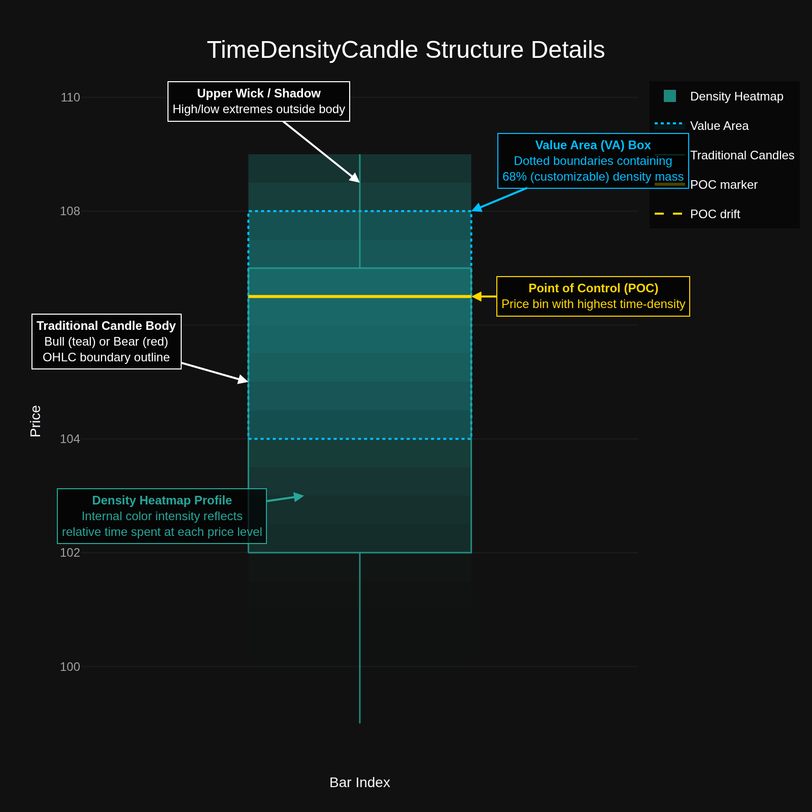
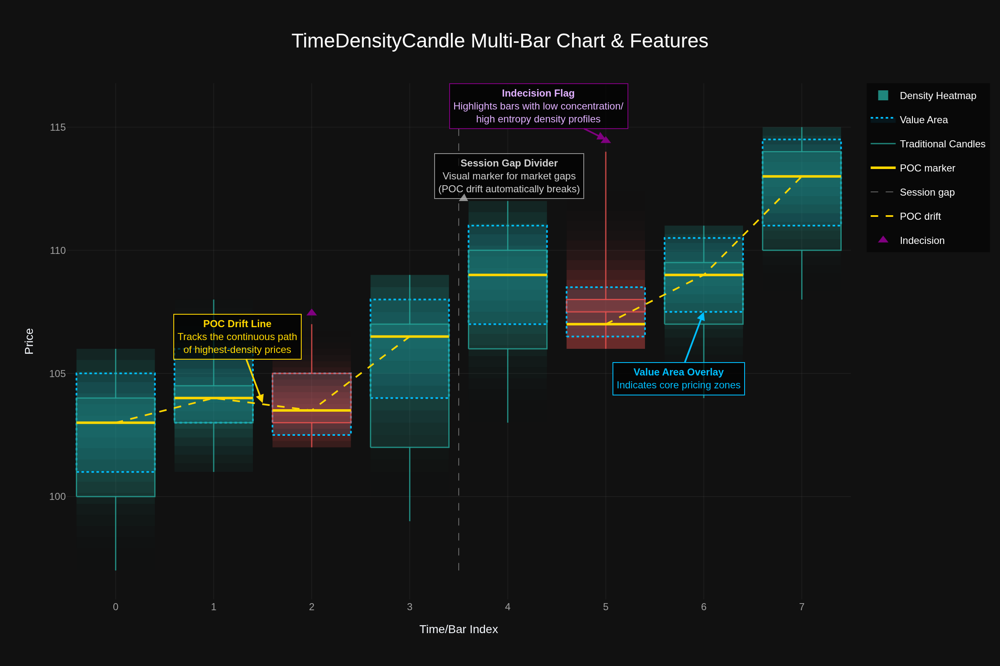

# TimeDensityCandle (TDC)

[](https://www.python.org/)
[](LICENSE.md)
[](https://github.com/astral-sh/ruff)
[](https://pytest.org/)

**TimeDensityCandle (TDC)** is a Python library and CLI tool that reconstructs and visualizes the internal distribution of prices within traditional OHLC candlestick bars. Instead of a flat-colored body, TDC overlays a **time-at-price density heatmap** inside the body or across the entire low-to-high wick range. 

TDC is designed for technical analysis, market research, and **Machine Learning feature engineering** (e.g., training YOLO pipelines or tabular classifiers directly on intrabar microstructure).

---

## 📸 Interactive Visual Suite

TDC uses a dark-themed Plotly engine to generate highly informative, annotated charts.

### 1. Single Candle Architecture
Each candle acts as a mini-profile, highlighting the relative distribution of time spent at each price level within the bar's lifetime:


### 2. Multi-Bar Chart & Feature Overlays
When rendering a series of candles, TDC displays continuous trends and flags microstructure events:


---

## 🗺️ Table of Contents

1. [Features & Potentials](#features--potentials)
2. [Algorithm Overview](#algorithm-overview)
3. [Installation](#installation)
4. [Quick Start](#quick-start)
5. [Configuration Reference](#configuration-reference)
6. [Machine Learning Feature Exports](#machine-learning-feature-exports)
7. [Accuracy & Confidence Metrics](#accuracy--confidence-metrics)
8. [Detailed Documentation](#detailed-documentation)
9. [Development & Versioning](#development--versioning)
10. [License](#license)

---

## 🚀 Features & Potentials

* **Intrabar Density Profiles**: Render horizontal gradients indicating time-at-price density, supporting both bull (teal) and bear (red) color systems.
* **Point of Control (POC)**: Automatically identify and plot the price level containing the highest density within each candle.
* **POC Drift Tracking**: Draw a trendline linking the POC of consecutive bars, with automatic breaks at market gaps or ambiguous bars.
* **Value Area (VA) Overlay**: Render bounds representing the narrowest price range that contains a customizable proportion (default `68%`) of the bar's price density.
* **Microstructure Feature Engineering**: Export statistical shape metrics (skewness, kurtosis, profile entropy, HHI) for direct consumption in quantitative trading models.
* **Dual Execution Modes**:
  * **Real Intrabar Mode**: Feed real tick or sub-bar data (via local CSV/Parquet files, or automatic Yahoo Finance 5-minute intraday fetches).
  * **Synthetic Bridge Mode**: Estimate the price distribution using a seedable, ensemble-backed random-walk model constrained exactly to the parent OHLC values.
* **Market-Aware Rendering**: Filter out pre/post-market hours, detect session gaps, and break trendlines dynamically.

---

## 🧠 Algorithm Overview

### 1. Density Profile Computation
Using intrabar price points, TDC bins prices over the high-low range. Let $N$ be the number of bins (`nbins`):
$$\text{bins} = \text{linspace}(\text{low}, \text{high}, N + 1)$$
Each sub-bar tick is mapped into its corresponding price bin. If volume is present, counts are weighted by volume. The final density is normalized relative to the maximum count:
$$\text{density}_j = \frac{\text{count}_j}{\max(\text{counts})}$$

### 2. Point of Control (POC) Tie Policies
When multiple bins share the maximum density, TDC handles the ambiguity using one of four configurable policies:
* `midpoint`: Average of the middle-most tied bin centers.
* `first`: Price of the first tied bin center.
* `centroid`: Gravity center of the entire density distribution.
* `ambiguous`: Do not output a single POC; mark as ambiguous and break the drift line.

### 3. Value Area (VA) Determination
The Value Area corresponds to the smallest contiguous set of price bins containing at least $68\%$ (or `value_area_ratio`) of the normalized density mass. It reflects the core pricing zone.

### 4. Indecision Flagging (Entropy & HHI)
To detect periods of market indecision, TDC computes:
* **Normalized Profile Entropy**: Measure of the flatness of the density distribution (from 0 to 1).
* **Herfindahl-Hirschman Index (HHI)**: Sum of squared density probabilities, measuring concentration.
* **Concentration Ratio**: Max density divided by mean density.
Bars with high entropy (low concentration) are flagged with a purple indicator.

### 5. Synthetic OHLC Bridge Paths
When real intrabar data is unavailable, TDC generates synthetic tick paths. It forces the simulation to visit the exact High and Low at randomized interior anchors and connects them using Brownian bridges clipped strictly to $[Low, High]$.

---

## 📦 Installation

Clone the repository and install the development dependencies using `uv`:

```bash
git clone https://github.com/shahabahreini/tdc-charts.git
cd tdc-charts
uv sync --dev
```

---

## ⚡ Quick Start

1. Run the default pipeline (uses Yahoo Finance 5-minute data for AAPL and outputs HTML/PNG files to `./output`):
   ```bash
   uv run tdc
   ```

2. Run with a custom configuration file:
   ```bash
   uv run tdc --config custom_config.yaml
   ```

---

## ⚙️ Configuration Reference

TDC is configured via `tdc.yaml`. Below are the primary configuration parameters:

| Config Path | Type | Default | Purpose |
| :--- | :---: | :---: | :--- |
| `app.output_dir` | `string` | `"./output"` | Target directory for generated HTML, PNG, and CSV exports. |
| `data.ticker` | `string` | `"AAPL"` | Ticker to fetch if using the Yahoo Finance source. |
| `data.intrabar_source` | `string` | `"yahoo"` | Intrabar source: `"yahoo"` (auto-fetch) or `"file"` (local data). |
| `data.intrabar_path` | `string` | `null` | Path to CSV/Parquet when `intrabar_source` is `"file"`. |
| `algorithm.mode` | `string` | `"real"` | Generation mode: `"real"` or `"synthetic"`. |
| `algorithm.nbins` | `int` | `20` | Number of density price bins within each parent candle. |
| `algorithm.value_area_ratio` | `float` | `0.68` | Target density mass for the Value Area. |
| `algorithm.poc_tie_policy` | `string` | `"midpoint"` | How to handle tied maximum density: `"midpoint"`, `"first"`, `"centroid"`, `"ambiguous"`. |
| `features.enable_poc_drift_line` | `bool` | `true` | Plot a trendline connecting POC prices. |
| `features.enable_indecision_flags` | `bool` | `true` | Plot markers indicating high-entropy/flat-profile bars. |
| `rendering.full_heatmap` | `bool` | `true` | Draw density blocks across the entire candle high/low range rather than just the body. |
| `rendering.extend_to_tails` | `bool` | `false` | Draw narrow density strips along wicks (used when `full_heatmap` is false). |
| `rendering.show_candles` | `bool` | `true` | Render traditional candle bodies and wicks (set to `false` to hide candles). |
| `rendering.show_session_gaps` | `bool` | `true` | Add visual vertical lines separating discontinuous trading days. |
| `rendering.break_poc_drift_on_gaps` | `bool` | `true` | Disconnect the POC drift line across detected session gaps. |

---

## 📊 Machine Learning Feature Exports

When exporting data (in CSV or Parquet format), TDC computes a comprehensive set of features per parent bar:

```
├── Parent OHLCV Fields: open, high, low, close, volume, timestamp
├── Density Microstructure: density_00, density_01, ..., density_nn
├── Point of Control (POC): poc_price, poc_bin_index, poc_confidence, poc_is_ambiguous
├── Value Area (VA): value_area_low, value_area_high, value_area_width_pct, value_area_confidence
├── Shape Metrics: skew, kurtosis, profile_entropy, profile_hhi, concentration_ratio
├── Trend & Gaps: poc_delta, poc_delta_pct, poc_delta_atr, poc_slope_3, session_gap
└── Confidence Metrics: profile_source, volume_mode, profile_confidence, confidence_level, profile_warning
```

These features can be used directly for tabular models or visualized to construct custom heatmaps.

---

## ⚠️ Accuracy & Confidence Metrics

TDC estimates confidence for every candle to prevent misleading signals:
* **High Confidence**: Real tick-by-tick CSV file matching parent candles exactly.
* **Medium Confidence**: Real Yahoo Finance sub-bar data (e.g., 5-minute intervals). It is a reliable estimate, but might miss microsecond peaks.
* **Low Confidence**: Synthetic bridge estimation. It is useful for visual profiling but does not represent true historical order flow.

---

## 📖 Detailed Documentation

Explore the guides in the `docs/` directory:
* 📄 [User Guide](docs/user_guide.md) - Installation, command usages, and config reference.
* 🛠️ [Developer Guide](docs/developer_guide.md) - Package structure, codebase details, and architecture design.
* 📈 [Accuracy and Confidence](docs/accuracy_and_confidence.md) - In-depth breakdown of confidence grading rules.
* 🗺️ [Technical Project Plan](docs/TDC_project_plan.md) - Underlying formulas, data structures, and roadmap details.

---

## 🔧 Development & Versioning

Run the test suite and formatter:
```bash
# Run lint check
uv run ruff check .

# Run unit tests
uv run pytest
```

Bumping package versions:
```bash
uv run bump patch   # 0.1.0 -> 0.1.1
uv run bump minor   # 0.1.0 -> 0.2.0
uv run bump major   # 0.1.0 -> 1.0.0
```

---

## 📄 License

This project is licensed under the MIT License - see the [LICENSE.md](LICENSE.md) file for details.
